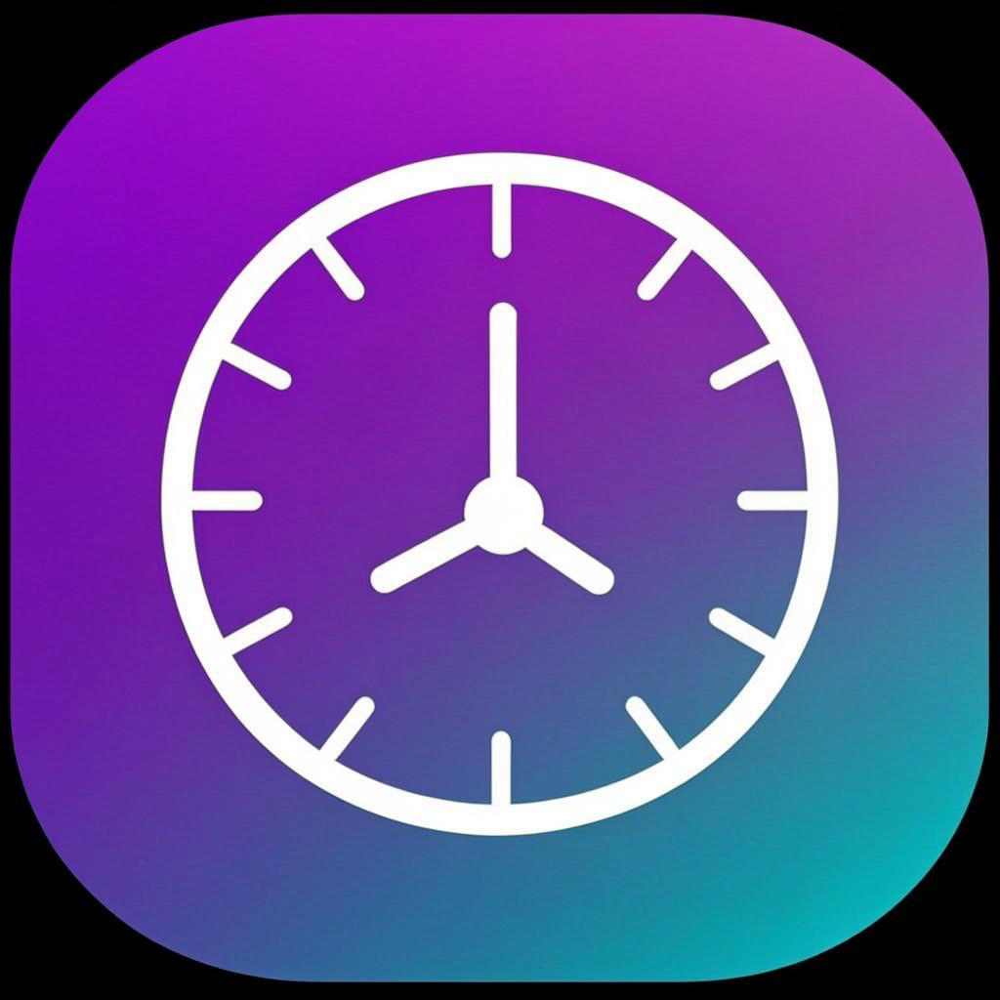

# Countdown - Track Your Moments ⏰

A beautiful, colorful countdown timer PWA to track your important moments. Works offline, syncs across devices, and plays custom sounds!



## ✨ Features

- **📊 Unlimited Countdowns** - Track birthdays, vacations, events, and more
- **🎨 Colorful Design** - 10 vibrant colors and 20 emoji icons
- **📴 Offline Support** - Works without internet connection
- **🔄 Device Sync** - Share countdowns between devices with a sync code
- **🔔 Notifications** - Get notified when countdowns end
- **🎵 Custom Sounds** - Upload your own sounds or use built-in alarms
- **📱 Widget Support** - Pin countdowns to home screen
- **🌙 Dark/Light Mode** - Automatic theme switching

## 🚀 Quick Deploy to Vercel

[](https://vercel.com/new/clone?repository-url=https://github.com/YOUR_USERNAME/countdown-app)

## 📱 Install as App

### iPhone (Safari)
1. Open the app URL in Safari
2. Tap the Share button (square with arrow)
3. Scroll down → "Add to Home Screen"

### Android (Chrome)
1. Open the app URL in Chrome
2. Tap the three dots menu (⋮)
3. "Add to Home Screen" or "Install app"

## 🛠️ Setup Instructions

### Step 1: Set Up Turso Database (FREE)

The app uses **Turso** for cloud database sync. It's free!

1. **Create a Turso Account:**
   - Go to [turso.tech](https://turso.tech)
   - Sign up (free tier - no credit card needed)

2. **Create a Database:**
   - Click "Create Database"
   - Name it: `countdown`
   - Click "Create"

3. **Get Your Credentials:**
   - Go to your database → **Settings**
   - Copy the **Database URL** (looks like: `libsql://countdown-xxx.turso.io`)
   - Go to **Authentication** → Create a token
   - Copy the **Auth Token**

### Step 2: Deploy to Vercel

1. Push this repository to GitHub
2. Go to [vercel.com](https://vercel.com)
3. Click "Import Project"
4. Select your GitHub repository
5. Add **Environment Variables:**
   ```
   TURSO_DATABASE_URL = libsql://your-database.turso.io
   TURSO_AUTH_TOKEN = your-auth-token-here
   ```
6. Click "Deploy"

### Step 3: Generate Database Tables

After deployment, run this command locally with your Turso credentials:

```bash
# Set environment variables
export TURSO_DATABASE_URL="libsql://your-database.turso.io"
export TURSO_AUTH_TOKEN="your-auth-token"

# Push schema to Turso
bun run db:push
```

Or use the Turso CLI:
```bash
turso db shell countdown < prisma/schema.sql
```

## 📦 Local Development

```bash
# Install dependencies
bun install

# Setup local database
bun run db:push

# Start development server
bun run dev

# Build for production
bun run build
```

## 🌐 Environment Variables

| Variable | Description | Required |
|----------|-------------|----------|
| `DATABASE_URL` | Local SQLite path | Local dev only |
| `TURSO_DATABASE_URL` | Turso database URL | Production |
| `TURSO_AUTH_TOKEN` | Turso auth token | Production |

## 📱 Convert to APK

1. Deploy to Vercel first
2. Go to [pwabuilder.com](https://pwabuilder.com)
3. Enter your Vercel URL
4. Click "Package for Stores" → Download APK

## 🔧 Troubleshooting

### Sync Not Working?
1. Make sure Turso environment variables are set in Vercel
2. Redeploy after adding the variables
3. Check Vercel logs for errors

### App Won't Load?
1. Check if Vercel deployment is successful
2. Verify database connection in Vercel logs

## 📄 License

MIT License - Feel free to use and modify!

---

Built with ❤️ using [Z.ai](https://chat.z.ai) 🚀
